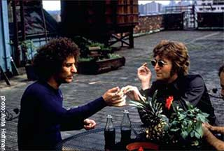
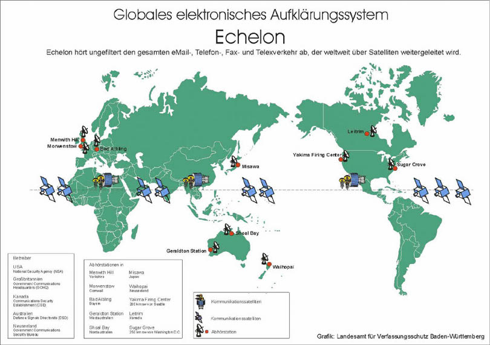
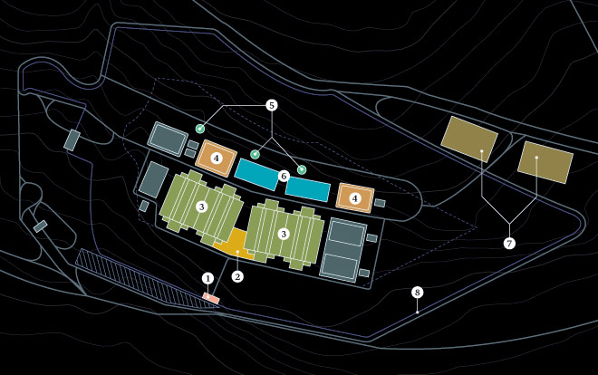

Software Libre, Rebeldía y Libertad
==========================================================================================

La siguiente diapositiva muestra una visión critica histórica del desarrollo del software desde la perspectiva del Hacker Rebelde(del raro, delincuente, perseguido) de aquellas personas que cuestionaron el desarrollo.

Para esto he extraído las ideas de la literatura _Hacker_ y de sus acciones mismas, cabe aclarar que por lo tanto es un visión parcial del desarrollo del Software.

Pese a este hecho sin lugar a dudas es una visión histórica muy importante ya que estas personas fueron(y son) una parte muy importante en la gestación y desarrollo de lo que hoy conocemos como Software Libre.

------------------------------------------------------------------------------------------

Los Hippies (60's)
==========================================================================================

La historia de la cultura __hacker__ tal vez tiene sus inicios en la época __hippie__, cuando un conjunto de jovenes luchadores sociales decidieron ocupar las tecnologias, para hacer de esto una forma de manifestación en contra de politicas Norteamericanas como la guerra de Vietman entre otras.

El caso mas conocido es el del [**Abbie Hoffman**(nov 30, 1936 – abr 12, 1989)](http://en.wikipedia.org/wiki/Abbie_Hoffman) un hippie quien escribio el libro _Steal This Book_ en el cual relata una serie de técnicas de sobrevivencia y formas de manifestación.

Entre las cosas que solia hacer relacionadas con las tecnologias era la intervención telefónica, realización de trasmisores para radio y tv que se apoderaban de la frecuencia de determinadas emisoras para dar sus discursos.

------------------------------------------------------------------------------------------

Los Phreakers (60's-70's)
==========================================================================================

Los _Phreakers_ es la primer cultura que se enfoca al ámbitio meramente técnico, el término nace de la descomposición de las palabras __Phone freak__(monstruo telefónico).

Esta historia tiene sus inicios en un niño de 9 años [Joe Engressia(25 may 1949 – 8 ago 2007)](http://es.wikipedia.org/wiki/Joe_Engressia) quien por cuestiones de azar descubre que al realizar determinado tipo de silvido podia emitir pulsos de control pudiendo con esto realizar llamadas a cualquier parte del mundo de manera gratuita.

La razón es que en la telefonía de esa época ocupaba el mismo canal para para trasmitir tanto la voz como las señales de control.

Al principio se dedicó a realizar bromas telefónicas, pero luego al aburrirse y decidio compartir sus secretos para asi formar un grupo conocido como los _phreakers_. Conformado por personas normalmente ciegas quienes se unian en la **red telefónica**.

Posteriormente le diria estos secretos al [Captán Crunch](http://es.wikipedia.org/wiki/John_Draper) quien con sus amplios conocimientos de eléctronica desarrollo la primera **caja azul**(un dispositivo electronico capaz de emitir estas pulsos de control). El capitán Crunch por cuetiones técnicas decide hablar respecto a su caja azul con [Steve Wozniak](http://es.wikipedia.org/wiki/Stephen_Wozniak) quien a su vez se lo cuenta a [Steve Jobs](http://es.wikipedia.org/wiki/Steve_Jobs) a quien se le ocurre la "**brillante idea**" de comercializarlas y con esto joden el secreto y con esto meten a la carcel al Capitán Crunch.

------------------------------------------------------------------------------------------

Los Hacker (70's - 80's)
==========================================================================================

El termino hacker que define a un experto informático, amante del conocimiento, este termino fue tomado por los investigadores del [MIT](http://es.wikipedia.org/wiki/MIT) para nombrarse entre ellos en forma de halago para enfatizar sus logros.

> _"La ética de los hackers propone la pasión, la  libertad para organizar el tiempo y el trabajo, metas que no toman el  dinero como fin en sí mismo, sino que se orientan a la cooperación y el  interés social"_.

>> __"La ética de los  hackers y el espíritu de la era de la información"__ - Pekka Himan(Filósofo finlandés).

Los Hacker rebeldes(_hacktivistas_) son un grupo de persona las cuales criticaron el desarrollo del Internet y del Software, a partir de fuertes interrogantes como la privacidad y la dependencia tecnológicas implícitas.

Veamos a más detalle la historia de estos **hackers**...

------------------------------------------------------------------------------------------

Historia del Internet
==========================================================================================

En los años 60 el ejercito Norteamericano en conjunto con la corporación [**RAND**(_Research AND Development_)](http://www.rand.org/about/)  se preguntaban como tener un medio de comunicación el cual tuviese la capacidad de [soportar ataques nucleares](http://es.wikipedia.org/wiki/ARPANET#El_mito_de_los_ataques_nucleares), en 1964 un miembro de **RAND**([**Paul Baran**](http://es.wikipedia.org/wiki/Paul_Baran)) plantea los principios en los cuales se deberá regir esta red de comunicación los cuales se resumen en 2 principios básicos:

 - **1.-** Red no centralizada.
 - **2.-** Diseñada para operar incluso hecha pedazos.

Para realizar una red basada en estos principios pidieron ayuda del [**UCLA**](http://es.wikipedia.org/wiki/UCLA) y del [**MIT**](http://es.wikipedia.org/wiki/MIT).

En el de 1969 el 1er nodo de esa red fue instalado en [**UCLA**](http://es.wikipedia.org/wiki/UCLA).

**Nace la [ARPANET](http://es.wikipedia.org/wiki/ARPANET):** una red descentralizada donde  científicos e investigadores podían compartir información entre ordenadores a distancia.

------------------------------------------------------------------------------------------

Separación entre _Hackers_ y el gobierno.
==========================================================================================

Por la mitad  de los años 70's, algunos de estos investigadores expertos en informática(_Hackers_) se empezaron a cuestionar la privacidad en una red donde la información pasa por múltiples equipos de computo.

Ellos sabían que técnicamente era relativamente fácil poner un _sninffer_(una maquina la cual tendrá la función de escuchar lo que pase por la red).

Fue entonces cuando empezaron a preguntar la forma de como poder generar una comunicación segura en un medio no seguro(la Red).

------------------------------------------------------------------------------------------

Separación entre _Hackers_ y el gobierno.
==========================================================================================

En 1976 los Hackers informáticos se dieron cuenta que sus suposiciones eran mas que ciertas cuando Winslow Peck publica la existencia de la red de espionaje **Echelon**.

**ECHELON** es considerada la mayor red de espionaje y análisis para interceptar comunicaciones electrónicas de la historia. Controlada por la comunidad UKUSA (Estados Unidos, Canadá, Gran Bretaña, Australia, y Nueva Zelanda), ECHELON puede capturar comunicaciones por radio y satélite, llamadas de teléfono, faxes y e-mails en casi todo el mundo e incluye análisis automático y clasificación de las interceptaciones. Se estima que ECHELON intercepta más de tres mil millones de comunicaciones cada día[1].

A pesar de haber sido presuntamente construida con el fin de controlar las comunicaciones militares y diplomáticas de la Unión Soviética y sus aliados, se sospecha que en la actualidad ECHELON es utilizado también para encontrar pistas sobre tramas terroristas, planes del narcotráfico e inteligencia política y diplomática. Sus críticos afirman que el sistema es utilizado también para el espionaje económico y la invasión de privacidad en gran escala[1]. 

1.- ECHELON - <http://es.wikipedia.org/wiki/Echelon>

------------------------------------------------------------------------------------------

¿Como funciona Echelon?
==========================================================================================

Su funcionamiento es similar al de un __buscador por Internet__.

Dado un mensaje **M** a este mensaje le corresponde un valor el cual describe la importancia del mensaje **M** respecto a un tema en especifico.

Por ejemplo si se quiere buscar a algunos __"terroristas"__ entonces las palabras **terrorista, libertad, estado, bomba, comunista, anarquista, libertario... ,etc**. son palabras las cuales pueden ser relacionadas a dicho tema, entonces lo que se hace es ver si estas palabras existen en el mensaje **M**, de ser asi se cuenta el número de veces aparece dichas palabras en **M**, De esta forma la probabilidad de que **M** sea un mensaje __"terrorista"__ está en función del echo que aparezcan dichas palabras y la frecuencia de ellas en **M**.

------------------------------------------------------------------------------------------

Mapa Mundial Echelon
==========================================================================================

------------------------------------------------------------------------------------------

La Rebeldía Plena
==========================================================================================

La cifrado seria pues la mejor solución ante el problema de trasmitir información en medios no seguros. Pues estas técnicas habían sido probadas con éxito en la 2da guerra mundial, ahora solo era cuestión de que estas técnicas las pudiesen ocupar todas las personas, fue entonces:

Cuando un grupo de hackers a fines de los ‘70 desarrolló técnicas  de cifrado avanzadas que habían copiado del Ejército de EE.UU., y  diseñó programas que garantizan la privacidad de las comunicaciones  por Internet, el gobierno de EE.UU. Puso esos programas en la lista de  productos con restricciones para la exportación. Sacarlos del país según  estas leyes implica un delito del mismo calibre que el tráfico de armas  nucleares. La difusión vía Internet de estos programas de cifrado,  gratis y con código abierto, logró que se convirtieran en un standard de  seguridad en todo el mundo[1].

1.- _"Internet, hackers y software libre"_ (libro hacktivista pag 11) - <http://dyne.org/editora_fantasma.pdf>

------------------------------------------------------------------------------------------

La caida de los Viejos Hackers
==========================================================================================

El software permite poner en relación al ser humano y a la máquina y también a las máquinas entre sí[1], Es por estas mismas razones por la cual tiene tantas implicaciones a nivel tecnológico y social(por lo cual debe ser libre).

Sin embargo los gobiernos se tardaron en darse cuenta del potencial del software.

 A pesar de todo esto en la comunidad Hacker se encontraba en fuerte disputa entre los los que pre pulsaban lenguajes avanzados(para entonces C[2]) y los mas duros expertos en lenguajes de bajo nivel(ensamblador y Maquina). Esta disputa permitió empresas emergentes(Apple y Microsoft) llegaran al mercado con sistemas operativos de  que  técnicamente eran(y son) inferiores pero mas allegados al publico en general(esto tiene que cambiar).
 
 - [1].- Cooperación sin mando: una introducción al software libre - Miquel Vidal
 - [2].-    Otro hacker llamado Denis Ritchie inventó un lenguaje llamado _"C"_ para usar bajo el _UNIX_ embrionario de _Thompson_.

------------------------------------------------------------------------------------------

La caída del modelo de cooperación
==========================================================================================

Pero a principios de los años ochenta el modelo de cooperación Hacker entra en crisis, y rápidamente comienza a emerger un modelo privatizador y mercantilista.

Pues en un mundo en donde la totalidad de las fuerzas productivas están bajo el capital, en la cual todo acaba valorizado en términos mercantiles, las empresas privatizadoras de software se habían tardado en advertirlo pero finalmente (con ayuda del Estado) se  lanzaron a la caza y captura de esta increíble máquina productiva y cooperación. que tal vez sea la mayor empresa colectiva que existe hoy día[1]. 

Mientras tanto nueva industria emergente del software comienza a apoyarse en la legislación sobre propiedad intelectual. 

El hacker que compartía el código y cooperaba con otras personas pasó a ser considerado un _"pirata"_.

Esa fue la forma de atacar mediaticamente para cambiar la opinión publica y poder ensuciar el termino __Hacker__.

 - [1].- __Cooperación sin mando: una introducción al software libre__ - Miquel Vidal.(Fracmetos extraidos)

------------------------------------------------------------------------------------------

La inconformidad Hacker
==========================================================================================

Las leyes de propiedad intelectual han corrompido completamente las relaciones y practicas humanas, confinando a la humanidad en un total individualismo, es por estas razones por las que no deben realizarse compromisos con estas leyes, y debe lucharse contra su justificación, habitualmente errónea.

Existian hackers que no aceptaron esta nueva situación y continuaron con sus prácticas pero parecía que solo era cuestión de tiempo para que la industria del software propietario arrinconara y dejara definitivamente fuera de la ley la cultura cooperativa.

>>"Muchos programadores están descontentos con la comercialización de software de sistema. Esta puede permitirles ganar más dinero, pero les requiere sentirse en conflicto con otros programadores en general en vez de sentirse como camaradas. El acto fundamental de amistad entre programadores es el compartir programas; ahora se usan típicamente arreglos de marketing que en esencia prohíben a los programadores tratar a otros como sus amigos. El comprador de software debe escoger entre la amistad y la obediencia a la ley. Naturalmente, muchos deciden que la amistad es más importante. Pero aquellos que creen en la ley a menudo no se sienten bien con ninguna de las dos opciones. Se vuelven cínicos y piensan que la programación es sólo otra forma de hacer dinero."

(R. Stallman,"El Manifiesto GNU",1985 [en http://www.gnu.org/gnu/manifesto.es.html]).

------------------------------------------------------------------------------------------

¿Pero que pasa en la actualidad?
==========================================================================================

Actualmente [se construye en un paraje más grande de Estados Unidos](http://www.bbc.co.uk/mundo/noticias/2012/03/120326_mayor_centro_espias_eeuu_fp.shtml) en desértico del estado de Utah con unos 90.000 metros cuadrados (cinco veces el Capitolio de Washington D.C.) y protegido por fuertes medidas de seguridad. Almacenara en sus bases de datos todo tipo de comunicaciones: los contenidos completos de correos privados, llamadas de celular y búsquedas de **Google**, así como todo tipo de huellas de datos personales: _tickets_ de estacionamiento, itinerarios de viaje, compras de libros y otra "basura de bolsillo". Este centro debera comenzar a funcionar en septiembre de 2013, según el [artículo](http://www.wired.com/threatlevel/2012/03/ff_nsadatacenter/all/1) de quien estara almando de este centro [**James Bamford**](http://en.wikipedia.org/wiki/James_Bamford).
 
 

------------------------------------------------------------------------------------------

Pero.. ¿es el Software?
==========================================================================================

Los equipos de computo se dividen basicamente en 2 partes:

 - **Hardware** - La parte dura, la tangible(los fierros).
 - **Software** - La parte suave, lo no tangible(Las instrucciones).

## Software

Conjunto de instrucciones que una persona(o grupo de ellas) escribe de forma tal que un aparato electrónico(computadora, celular, etc..) es capaz de interpretar.

Es abstracción pura, es meramente conocimiento y el conocimiento es algo que no puede ser sectario.

Al igual que un poeta que estudia verso y prosa para hacer los mejores poemas, nosotros los programadores estudiamos algoritmia y matemáticas para realizar los mejores códigos.

-------------------------------------------------------------------------------------------

Los inicios  del SL
==========================================================================================

El __SL__ nace de la necesidad de que exista una forma legal la cual garantice los derechos del conocimiento colectivo.

Nace de __Richard Stallman__ un prestigioso hacker Neoyorquino(creador de _Emacs_). Nació en 1954, se graduó en Harvard en 1971 y trabajó en el laboratorio de Inteligencia Artificial del MIT hasta principios de los 80's. Cuando la mayoría de sus compañeros partieron en busca de empleo en grandes empresas, el decidió iniciar el proyecto **GNU** para mantener vivo el espíritu de colaboración y trabajo colectivo de los primeros hackers.

El software libre es una concepción colectiva de la propiedad la cual respeta plenamente el derecho del autor sólo que dichos derechos se seden legalmente a la Humanidad.

------------------------------------------------------------------------------------------

El SL y la Libertad
==========================================================================================

Una de las cosas de la cual los usuarios de libres nos sentimos más orgullosos es de [nuestro logotipo](http://www.gnu.org/graphics/agnuhead.html). El cual es un antílope([_Ñu_](http://es.wikipedia.org/wiki/%C3%91u)) el cual habita en el áfrica,entre sus características principales destaca el hecho es el único mamífero el cual puede convivir en grupos(manadas) tan grandes(miles) sin que exista un [**MACHO alfa**](http://es.wikipedia.org/wiki/Macho_alfa)(un líder o jefe) puesto que para que inicien su peregrinaje basta con el primero que avance, estas manadas suelen ser buscadas por otras especies(como cebras y gacelas) para defenderse de los depredadores.

El Autor del logotipo nunca se adjudico el crédito, seria bueno saber quien fue para poder agradecerle sin embargo este hecho hizo que el logotipo se quedara de forma definitiva como símbolo de libertad.  __¿Que mas libre que algo que es propiedad de todos y pertenencia de nadie?__.

------------------------------------------------------------------------------------------

Fundamentos del SL
==========================================================================================

El SL se basa de la libertad intelectual partiendo de la premisa que no existe un pensamiento aislado pues en gral. cada idea que tenemos es producto de nuestras experiencias, de otras ideas, de nuestro entorno y nuestra sociedad. Para garantizar dicha libertad es necesario que las ideas sean libres, en el caso del SL existen 4 libertares:

 - **0:** la libertad de usar el programa, con cualquier propósito 
 - **1:** la libertad de estudiar cómo funciona el programa(conocer como esta hecho). 
 - **2:** la libertad de distribuir copias, con lo que puedes ayudar a tu vecino. 
 - **3:** la libertad de mejorar el programa y hacer públicas las mejoras a los demás, de modo que toda la comunidad se beneficie.

>> "En general la decisión de usar SL o no, no debe de ser difícil solo se trata de cuestionar que tanto valoras tu libertad" - **R. Stallman**.

------------------------------------------------------------------------------------------

El SL y el Comercio
==========================================================================================

Es una mentira el pensar que el SL es gratuito pues los programadores necesitan también de cuestiones materiales para sobre llevar su vida.

El Comercio es una practica social de intercambio de bienes y servicios la cual lamentablemente hemos corrompido.

El comercio del SL se basa más que de productos en servicios. Cuando una empresa de SL nos vende un Software en realidad no te venden el producto(por que esto es conocimiento) en realidad lo que nos venden es el servicio de las personas que programaron dicho Software.

Si este del **Software de uso generico**, al comprar(o donar) **SL** estamos contribuyendo al desarrollo de la tecnología con fines mas humanos al mismo tiempo que le quitamos el poder a las grandes corporaciones y gobiernos que son las que rigen la ciencia y la tecnología en la actualidad.

En el caso del **Software a la medida** lo que estamos pagando es el hecho de que tengamos un grupo de personas las cuales ofrecen su fuerza laboral e intelectual.

------------------------------------------------------------------------------------------

El Comercio sano
==========================================================================================

El **SL** nos ofrece una forma de comercio sano y como tal requiere de un cierto compromiso entre el cliente y el comerciante:

Para esto el cliente deberá procurar adquirir Software en empresas locales y orientaras al **SL**, por otra parte estas empresas deberán tener disposición de cooperación que les permita agruparse con otras empresas(análogas al modelo SL generando modelo de Clusters) y con esto poder hacer frente al viejo modelo de comercio donde las grandes corporaciones devoran a las empresas pequeñas.

__Lo mejor de todo esto es los programadores de SL solemos ser personas que programamos con mas amor, entusiasmo y pasión que los que lo hacen por fines preponderantemente económicos. Ofreciendo con esto niveles de calidad mas altos__.

------------------------------------------------------------------------------------------

SL para Tod@s
==========================================================================================

La iniciativa personal, la autogestión de proyectos que partiendo de necesidades personales o locales, luego terminan beneficiando a la sociedad en general.

Un paradigma de esto es el caso de Linus Torvalds, el hacker finlandés que en 1991 empezó a programar un sistema operativo tipo Unix; un proyecto que con el tiempo se convertiría en Linux, el sistema operativo de distribución gratuita que hoy usan millones de personas.

De igual forma pasa con la actual sociedad Hacker donde:

>> La ética de los hackers propone la pasión, la libertad para organizar el tiempo y el trabajo, metas que no toman el dinero como fin en sí mismo, sino que se orientan a la cooperación y el interés social. **La ética de los  hackers y el espíritu de la era de la información**  - _Pekka Himanen_(filósofo Finlandés).

Desde el momento en que me involucré en la creación de nuevas tecnologías, sus dimensiones éticas me han interesado. Por qué **el futuro no nos necesita** - _Bill Joy_.

El futuro del SL
==========================================================================================

En la actualidad el **SL** ya no esta sólo en manos de los grandes _gurus del Software_ si no mas bien de la sociedad en general.

Sin embargo sigue existiendo una gran diferencia potencial entre las personas que saben programar y las que solo son usuarios del software en general.

Esto se debe al hecho de que es una practica difícil para el celebro humano, es por esto que resulta necesario crear herramientas y métodos de programación que hagan sentir cómodo al celebro, que al igual que una silla ergonómica la cual esta hecha a nuestra estructura fisiológica la cual hace sentir cómodo a nuestro cuerpo de igual forma la programación debería ser adaptarse a nuestro celebro y no el hombre a la maquina(p.e. los lenguajes de bajo nivel)[1].

Predecir el futuro del **SL** es difícil sin embargo podemos soñar

con lo que queremos del SL y debemos luchar día a día por ello

**"Los sueños son la flor del pensamiento"** (_Netzahuatcoyot_).

[1] .- Esta idea fue plasmada en una clase que tuve del “Dr. Manuel H. Gutierrez.” a quien le tengo un alto grado de admiración no por su nivel intelectual(que sin duda es uno de los mas grandes programadores que halla conocido) si no mas bien por su pensamiento tan critico de las cosas.
Posteriormente observe este mismo comentario(con otras palabras) en su libro. "programación funcional, lógica, y relacionadas".

------------------------------------------------------------------------------------------

Agradecimientos
==========================================================================================

Quisiera agradecer a mis ex-compañeros de escuela que estuvieron pendientes de esta presentación(Claudia, Karen “la China”, Gohxn, R00tW33d,  KeopsLex, etc..).

A mis padres que me dieron una educación en un margen de mayor libertad que lo habitual, a su confianza en esta educación y en mi persona, pero sobretodo por  el gran amor que me han trasmitido el cual me ha enseñado que en la acción de retransmitirlo a mis semejantes aumenta y se retroalimenta.

A mi hermano **Eymard** y mis colegas de **SL** que con su entusiasmo y calidez humana me motivan día con día a continuar mi compromiso transado.

A cada uno de los autores anteriormente mencionados por dejar sus ideas a la humanidad, lo cual nos enseña que al final de esta vida lo importante no es lo que te llevas(nada) si no lo que dejas(tus actos e ideas).

A mis amigos __radicales__ que están haciendo de su forma de pensar su estilo de vida pues:

>> "si no vives como piensas acabaras pensando como vives" - **la Caja de Hierro** -  <http://www.masquepalabras.org/lacajadehierro/>

Y en general a toda la sociedad que ha marcado lo que hoy soy.
